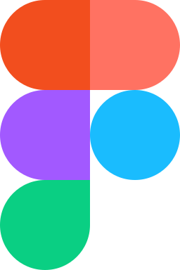

## Hi 👋, I'm Luis Guilherme

- Building softwares for more than 10 years
- Focused on web development

---

### Techs I've used/using 🛠️

  
  
  
  
  
  
  
  
  
  
  
  
  
  
  

  
  
  
  
  
  
  
  
  
  
  
  
  
  
  
  
  
  
  
  
  
  
  
  
  
  
  
  
  

  
  
  
  
  
  
  
  
  
  
  
  

---

### Connect with me

  
  
  
  
  

